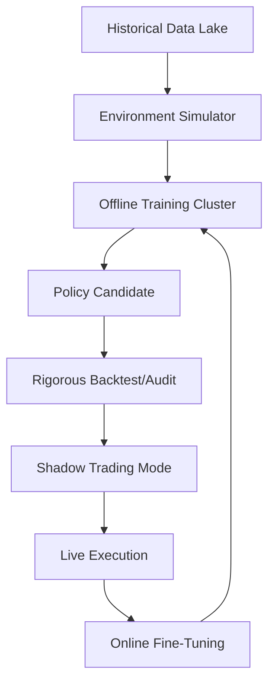

# Reinforcement Learning for Trading

**Reinforcement Learning (RL)** represents the "Third Paradigm" of Machine Learning in quantitative finance. Unlike Supervised Learning (predicting the next return) or Unsupervised Learning (finding clusters), RL directly optimizes for **optimal behavior** in a dynamic, stochastic environment.

At J.P. Morgan, we use RL not just for "beating the market," but for solving complex, high-dimensional control problems like **Optimal Execution**, **Dynamic Hedging**, and **Liquidity Provision**.

---

## 1. The MDP Formulation in Trading

A trading strategy is modeled as a **Markov Decision Process (MDP)** defined by $(S, A, P, R, \gamma)$:

- **State Space ($S$):** The agent's view of the market. This includes exogenous data (Limit Order Book, news sentiment) and endogenous data (Current Position, Unrealized P&L, Execution Time Remaining).
- **Action Space ($A$):** The set of possible moves. 
    - *Discrete:* {Buy, Hold, Sell} or {Aggressive, Passive, Neutral}.
    - *Continuous:* Target portfolio weights $w \in [0, 1]^n$ or trading rate $\dot{x}$.
- **Transition Probability ($P$):** The market dynamics. In trading, $P$ is unknown and highly non-stationary.
- **Reward Function ($R$):** The signal the agent maximizes (e.g., Risk-Adjusted P&L).
- **Discount Factor ($\gamma$):** How much the agent values future rewards. Typically $\gamma \in [0.9, 0.999]$.

---

## 2. Advanced State Engineering

Simple OHLCV data is insufficient for institutional RL. We employ a hierarchical state representation:

| Layer | Features | Purpose |
|-------|----------|---------|
| **Microstructure** | Order Book Imbalance (OBI), VPIN, Queue Position. | Short-term liquidity detection. |
| **Momentum** | Hurst Exponent, RSI, Moving Average Crossovers. | Trend persistence. |
| **Endogenous** | Avg Fill Price, Inventory Risk, Latency to Exchange. | Portfolio state management. |
| **Latent** | Hidden Markov Model (HMM) states, Autoencoder embeddings. | Regime identification. |

---

## 3. Reward Function Design

The reward function is the single most critical component. A naïve "Daily Return" reward leads to overtrading and ruin.

### A. Differential Sharpe Ratio (DSR)
A recursive estimate of the Sharpe Ratio that allows for online learning without needing to store the entire history.
$$ \Delta SR_t = \frac{\eta_t - \mu_{t-1} \sigma_{t-1}}{ \sigma_{t-1}^2 } $$

### B. Implementation Shortfall (for Execution)
Maximize the difference between the execution price and the arrival price, adjusted for market risk.
$$ R_t = (P_t - P_{arrival}) \times \text{side} - \lambda \cdot \text{Variance} $$

### C. The Cost of Turnover
We must explicitly penalize the "action cost" to prevent the agent from burning capital on commissions.
$$ R_{net} = R_{gross} - c \cdot |a_t - a_{t-1}| $$

---

## 4. State-of-the-Art Architectures

### A. Soft Actor-Critic (SAC)
The preferred algorithm for continuous action spaces (e.g., Portfolio Weights). It maximizes both the **expected reward** and the **entropy** of the policy, encouraging exploration and preventing premature convergence.

### B. Proximal Policy Optimization (PPO)
The industry standard for stability. It uses a "clipped" objective function to ensure that policy updates aren't too large, which is vital in noisy financial environments.

### C. Recurrent RL (LSTM/GRU)
Crucial for markets with "memory." Recurrent layers allow the agent to track latent variables like current volatility or hidden trends that aren't explicitly in the state.

---

## 5. The Sim-to-Real Challenge

The greatest hurdle in RL for trading is the **Simulation Gap**.

1.  **Backtest Overfitting:** RL agents are masters at "gaming" a simulator. If your simulator doesn't model slippage and market impact correctly, the agent will learn unrealistic "arbitrage" that doesn't exist live.
2.  **Adverse Selection:** In a simulator, you always get filled at the mid-price. In reality, you only get filled when the market moves *against* you.
3.  **Simulation Fidelity:** We use **GANs (Generative Adversarial Networks)** to generate synthetic market paths that are statistically indistinguishable from real data to "stress test" the agent.

---

## 6. Institutional Implementation Architecture

A production RL system at JPM involves two distinct pipelines:



- **Shadow Mode:** The agent runs live but its orders are never sent to the exchange. We monitor its "theoretical P&L" against the real market.
- **Kill Switches:** Hard limits on maximum drawdown or message-per-second rates that override the RL agent.

---

## 7. Python Implementation Sketch (Actor-Critic)

```python
import torch
import torch.nn as nn

class TradingPolicy(nn.Module):
    """
    Continuous action policy for portfolio weighting.
    """
    def __init__(self, state_dim, action_dim):
        super().__init__()
        self.backbone = nn.Sequential(
            nn.Linear(state_dim, 256),
            nn.ReLU(),
            nn.LSTM(256, 128, batch_first=True)
        )
        self.actor = nn.Linear(128, action_dim) # Mean of weight distribution
        self.critic = nn.Linear(128, 1)          # Estimated Value of state

    def forward(self, x):
        features, _ = self.backbone(x)
        # Apply softmax to actor output to ensure weights sum to 1
        weights = torch.softmax(self.actor(features[:, -1, :]), dim=-1)
        value = self.critic(features[:, -1, :])
        return weights, value
```

---

## Related Notes
- [[Reinforcement Learning]] — General theory and background.
- [[Alpha Research]] — Generating the features for the RL agent.
- [[Machine Learning Strategies]] — Comparing RL to supervised methods.
- [[Market Impact Models]] — Essential for building realistic simulators.
- [[Transaction Cost Models]] — Calculating the "Action Cost" correctly.
- [[Portfolio Optimization]] — The problem RL often solves.
